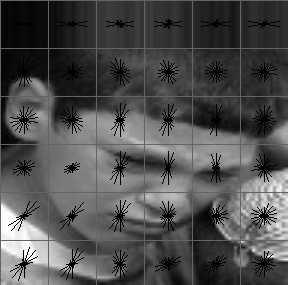
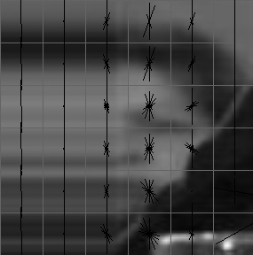
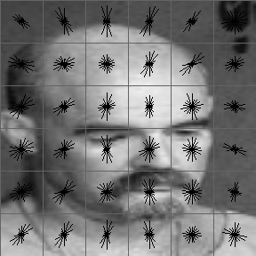
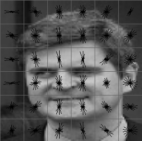
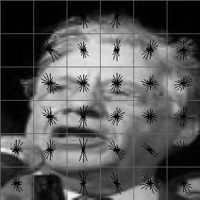
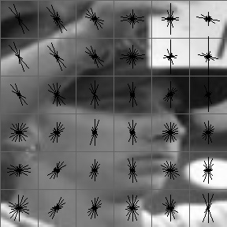

# CS385 PORJ1 report

杨晨宇 516030910537

I have to say sorry before beginning this report for this project is really a poorly completed one. I devoted most of my time into implementation of the framework in C++, and resulted in an unfinished work that can be seen on [github](https://github.com/yangcyself/CS385cpp.git). The C++ work depends on three packages: 1) **Google's protocol buffer** for storing and communicating the data,  2） **Eigen** for matrix calculation and manipulation, 3）**opencv** for basic picture processing. I challenged myself in building a simple machine learning system on my own, and now stop at the stage that basic network structures are **tested and can work** (see the [test programs](<https://github.com/yangcyself/CS385cpp/tree/master/test>)). Now the time does not allow me to further finish this course work on C++. Thus I have to restart this project on python, and the following sections introduce the finished parts (three in c++ and three in python) for this project. 

## Raw Picture Processing

### cutting resizing and dividing datasets

The raw picture processing source file is [processImage.cpp](./processImage.cpp).  In this program, the raw faces are cut, resized, and putted into corresponding folder. To generate a full dataset, use the bash script [generageDataset.sh](./generageDataset.sh) to call the picture processing program 9 times, each time indicating the input folder, whether the output is train dataset or test dataset, and whether to generate negative samples.

`bash ./generageDataset,sh`

### calculating and visualizing Hog features

I use the `opencv::HOGDescriptor` to calculate the Hog features, forms a 900d descript vector for each picture , as in [hogCalculate.cpp](./hogCalculate.cpp) . I save the calculated the Hog feature into binary file using Protocol buffer, formatted as in the file [dataset.hog.proto](protobuf\dataset.hog.proto)

To visualize the Hog features, use the program complied from [hogOutVisualize.cpp](./hogOutVisualize.cpp), which reads in the protobuf binary file and visualize the hog feature saved in it. Here I visualize the hog vectors on the original graph for a better visualization effect. Some example visualization results are as following.

     


## Logistic Model

The C++ Logistic implementation is in [logistic](./logistic), and using the [logisticMain.cpp](logisticMain.cpp) to train and test the model.  With learning rate 0.1 and Langevin 0.001

```bash
./logisticMain 0.01 0.001
```

After training for 1 epoch, the train accuracy and test accuracy can all reach 0.8. But that's because the model learned to guess 0 for all inputs.

After training for 10 epoch, the situation still remains the same,  and so are the other epochs

With learning rate 0.0005 and Langevin 0.00001

```bash
./logisticMain 0.0005 0.00001
```

The accuracies of the initial epochs are:

> train test
>
> 0.81 0.82
>
> 0.95 0.96
>
> 0.95 0.96
>
> and on ...

And at epoch 100, the model can reach

0.971 for train accuracy and 0.975 for test accuracy


## Fisher Model

The fisher model is implemented in the folder [fisher](./fisher), and using [fisherMain.cpp](fisherMain.cpp) to train and test the model.

When the model do classifying, it uses the middle point of the embedded mean value of positive samples and negative samples as the threshold.  The final accuracy is **0.980 for training and 0.977 for testing**.

The embedded training set has the following inter and intra variance:

> intra variance for positive samples: 0.00929 
>
> intra variance for negative samples: 0.00245
>
> inter variance for whole samples: 0.0199

We can find that the inter variance is much larger than inter variance.


## SVMs

The code for SVM can be seen in [SVM.py](./python/SVM.py) In which four kinds of kernels are tested, namely: "linear", "poly", "rbf", and "sigmoid". The scripts uses the SVC class provided by `sklearn`. 

The testing result can be shown following:


### linear

ACC:  0.9803959254276379
support number:  1261

                     


### poly

ACC:  0.8010763021333845
support number:  8272

                     


### rbf

ACC:  0.9667499519507976
support number:  3660

                     


### sigmoid

ACC:  0.9621372285220066
support number:  4597

                     


### Observation

We can find an interesting phenomenon that the more complex the kernel (that is, more non-linearity), the poorer the testing performance. For example, the poly model uses most support vectors (means the hyper plane is complex), but the testing accuracy is little greater than guess all zero.  From this observation, we can say that the most important issue for SVM in this task is overfitting. Thus, the higher expressiveness in model leads to higher dangers in overfitting.


## CNN

### CNN with C++

The C++ implementation of CNN can be seen on [github](<https://github.com/yangcyself/CS385cpp/tree/master/cnn>). However, as mentioned at the beginning, I do not have the time to test on a real classification task (due to the amount of work in implementing a minibatch data loader and the potential difficulties). I have checked the correctness of each modules by comparing the result on toy data with the result calculated by hand. 

To construct a CNN frame work by hand, two key issues have to be solved. The first one is the convolution calculation, and the second one is to design a abstraction that allows forward and backward propagation. 


### CNN with off the shelf frameworks

I use Keras as the frame work for it is super easy. I built a four-layer network with feature map channel numbers `64, 256, 256, 256` 

With learning rate = 0.001, weight decay= 1e-6 and momentum=0.9, after trained for 20 epochs, finally the training and testing accuracy reaches 

> train accuracy: 0.9815  	test accuracy: 0.9822

## face detection

The face detection file can be seen at [python/faceDection.py](./python/faceDection.py) , in which a window is cut from all kinds of positions and scales, and run the classifier to get the result. The result can be seen as following. (the result has been choose to be representative)

### Linear SVM


#### polySVM


The Poly SVM can hardly find any positive results

#### rbfSVM


#### CNN 


#### LOGISTIC


we can find that if the boxes can be clustered together, the result will be much better.

